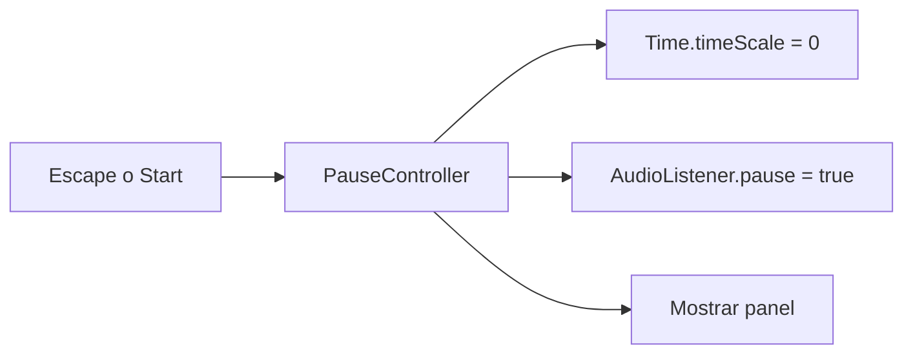

# Sesión 37: pausar el juego ⏸️

Duración aproximada: 45–60 minutos.

## 🎯 Objetivo

Pausar y reanudar la partida con `Escape` o el botón Start de un mando, mostrando un panel que continúa respondiendo.

## ⭐ Lo nuevo

- `Time.timeScale` controla la velocidad del tiempo simulado.
- `AudioListener.pause` pausa el sonido general.
- Una interfaz puede seguir funcionando aunque el mundo esté detenido.

## 1. Entender la pausa

Pausar no significa destruir ni desactivar todos los objetos. Reducimos la escala temporal a cero y mantenemos activo el controlador que permite continuar.

> 💡 **Qué acabas de aprender:** el tiempo del juego y la ejecución de la interfaz pueden administrarse por separado.

## 2. Crear el controlador

1. Abre `Assets > Kogi > Scripts > UI`.
2. Crea `PauseController.cs`.
3. Añade la propiedad `IsPaused`.
4. Detecta `Escape` y `Gamepad.startButton` en `Update`.
5. Cuando pauses, asigna `Time.timeScale = 0`.
6. Cuando continúes, devuelve `Time.timeScale = 1`.

El controlador se crea automáticamente y utiliza `DontDestroyOnLoad`, igual que el gestor de audio.

## 3. Coordinar el sonido

1. En `SetPaused`, asigna `AudioListener.pause = paused`.
2. Al destruir el controlador, restablece el tiempo y el audio.

Cuando incorpores los estados de fin de partida de la sesión 38 y victoria de la 45, añade al inicio de `SetPaused` la condición `if (GameFlowController.Instance != null && GameFlowController.Instance.IsFinished) return;`. Escape no debe reactivar el mundo detrás de una pantalla final. `ClearPause()` queda reservado para limpiar la pausa al reiniciar o cargar una escena.

Esto evita dejar el proyecto accidentalmente congelado al detener ▶️.

## 4. Probar

1. Pulsa ▶️.
2. Mueve a Kogi.
3. Pulsa `Escape`.
4. Comprueba que Kogi, enemigos y proyectiles quedan detenidos.
5. Pulsa de nuevo `Escape` o el botón **Continuar**.
6. Comprueba que la partida continúa normalmente.

## ✅ Comprobación final

- [ ] `Escape` alterna entre pausa y ejecución.
- [ ] El panel aparece centrado.
- [ ] Los enemigos y la física se detienen.
- [ ] El audio queda pausado.
- [ ] Al continuar, `Time.timeScale` vuelve a `1`.
- [ ] Console no muestra errores rojos.

## 🧰 Problemas frecuentes

- **El juego permanece congelado:** comprueba que `SetPaused(false)` asigne `Time.timeScale = 1`.
- **Escape cambia dos veces:** utiliza `wasPressedThisFrame`, no `isPressed`.
- **El audio continúa:** asigna también `AudioListener.pause`.
- **La pausa desaparece al cambiar de nivel:** conserva `DontDestroyOnLoad`.

---

[⬅️ Sesión anterior](36-musica-y-mezcla.md) · [🏠 Inicio](../../README.md) · [Siguiente sesión ➡️](38-fin-de-partida.md)
