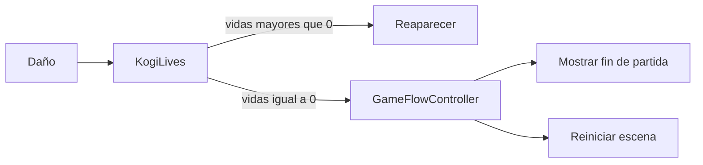

# Sesión 38: mostrar el fin de partida y reiniciar 💀

Duración aproximada: 45–60 minutos.

## 🎯 Objetivo

Reemplazar el reinicio inmediato por un estado de fin de partida claro, con mensaje y decisión del jugador.

## ⭐ Lo nuevo

- Un **estado global de partida** coordina reglas que afectan a toda la escena.
- Perder la última vida emite una consecuencia, pero `KogiLives` no dibuja interfaces.
- El reinicio restablece explícitamente tiempo y audio.

## 1. Separar responsabilidades

Antes, `KogiLives` recargaba la escena directamente. Ahora delega el estado final a `GameFlowController`.

> 💡 **Qué acabas de aprender:** una clase debe comunicar lo sucedido sin asumir todas sus consecuencias visuales.

## 2. Crear el estado de fin de partida

1. Crea `GameFlowController.cs` dentro de `Scripts > UI`.
2. Añade `IsGameOver`.
3. En `ShowGameOver`, detén el tiempo y pausa el audio.
4. Muestra un panel con el texto **FIN DE PARTIDA**.
5. Permite reiniciar con `R`, Enter o el botón visible.

Al mostrar el fin de partida, limpia la pausa anterior, desactiva la entrada de juego con `PlayerInput.DeactivateInput()` y congela tiempo y audio. El controlador global sigue leyendo `R` y Enter, por lo que el botón de reinicio funciona. La nueva escena crea un `PlayerInput` activo.

Centraliza la limpieza en `ResumeForSceneLoad()`: borra el estado final, limpia la pausa y restablece tiempo y audio **antes** de cargar. No basta con poner `Time.timeScale = 1`, porque la bandera `IsGameOver` seguiría mostrando la pantalla anterior.

## 3. Conectar las vidas

1. Abre `KogiLives.cs`.
2. Localiza la condición `currentLives <= 0`.
3. Sustituye la recarga directa por `GameFlowController.Instance.ShowGameOver()`.
4. Conserva la reaparición normal cuando todavía queden vidas.
5. Al inicio de `LoseLife`, ignora el daño si las vidas ya son cero o la partida ha terminado. Así varios contactos en el mismo instante no producen vidas negativas ni cambian una victoria por una derrota.

## 4. Probar

1. Pulsa ▶️.
2. Pierde una vida y comprueba que Kogi reaparece.
3. Pierde las tres vidas.
4. Comprueba que aparece el panel y el mundo queda detenido.
5. Pulsa `R` y verifica que el nivel comienza con tres vidas.
6. Vuelve a perder y pulsa Escape: la pantalla final debe permanecer y el mundo seguir congelado.

## ✅ Comprobación final

- [ ] Las dos primeras pérdidas producen reaparición.
- [ ] La última pérdida muestra el fin de partida.
- [ ] El escenario queda detenido detrás del panel.
- [ ] `R`, Enter y el botón permiten reintentar.
- [ ] El nivel vuelve a comenzar con tres vidas.
- [ ] Console no muestra errores rojos.

## 🧰 Problemas frecuentes

- **La escena reinicia inmediatamente:** elimina la llamada antigua a `SceneManager.LoadScene` de `KogiLives`.
- **El nivel sigue moviéndose:** confirma `Time.timeScale = 0`.
- **Después de reiniciar continúa pausado:** restablece tiempo y audio antes de cargar la escena.

---

[⬅️ Sesión anterior](37-pausa.md) · [🏠 Inicio](../../README.md) · [Siguiente sesión ➡️](39-transicion-entre-niveles.md)
