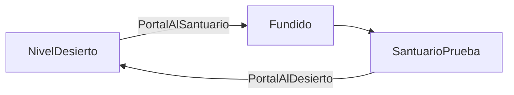

# Sesión 39: cambiar entre niveles 🚪

Duración aproximada: 60 minutos.

## 🎯 Objetivo

Entrar en un portal, aplicar un fundido y cargar una segunda escena llamada `SantuarioPrueba`.

## ⭐ Lo nuevo

- `SceneManager` carga escenas durante la ejecución.
- La lista de escenas del build determina cuáles puede abrir el juego final.
- Una transición oculta el cambio brusco entre dos mundos independientes.

## 1. Entender una escena como nivel



Cada escena contiene su propia jerarquía, luces, enemigos y límites. Los servicios persistentes, como audio y pausa, sobreviven al cambio.

> 💡 **Qué acabas de aprender:** un nivel puede ser una escena, pero los sistemas globales no deberían pertenecer exclusivamente a ella.

## 2. Crear `ScenePortal`

1. Crea `ScenePortal.cs` dentro de `Scripts > Environment`.
2. Exige un `Collider2D` configurado como Trigger.
3. Define el nombre de la escena de destino.
4. Detecta la entrada de un objeto con `KogiLives`.
5. Antes de cargar, aumenta gradualmente una capa negra.
6. Carga mediante `SceneManager.LoadScene`.

## 3. Preparar las escenas

1. En la ventana **Project**, abre `Assets > Kogi > Scenes` y haz doble clic en `NivelDesierto`.
2. En el menú superior del Editor, selecciona **GameObject > 2D Object > Sprites > Square**. Renombra el objeto nuevo como `PortalAlSantuario`.
3. Selecciónalo en **Hierarchy**. En **Inspector > Transform**, escribe **Position** `(14, 0, 0)` y **Scale** `(0.65, 3, 1)`.
4. Comprueba que tiene **Sprite Renderer**, con **Sprite = Square**. En **Color**, elige un azul claro. Este componente dibuja el portal; no detecta al jugador.
5. Al final del Inspector, pulsa **Add Component**, busca `Box Collider 2D` y añádelo. Marca **Is Trigger**. Este componente detecta la entrada de Kogi sin bloquearlo.
6. Pulsa otra vez **Add Component**, busca `Scene Portal` y añádelo. Configura **Target Scene** como `SantuarioPrueba` y **Transition Duration** como `0.35`.
7. Guarda `NivelDesierto` con `Ctrl + S`.
8. En **Project**, selecciona el archivo `NivelDesierto` y pulsa `Ctrl + D`. Renombra la copia como `SantuarioPrueba` y ábrela con doble clic.
9. En la **Hierarchy de SantuarioPrueba**, renombra la copia del portal como `PortalAlDesierto`. Cambia **Position** a `(-14, 0, 0)` y **Target Scene** a `NivelDesierto`. Guarda con `Ctrl + S`.
10. En el menú superior, abre **File > Build Profiles > Scene List**. Añade ambas escenas y deja `NivelDesierto` antes de `SantuarioPrueba`. Retira `SampleScene` de esta lista si todavía aparece; esto no borra su archivo.

El nombre escrito en el portal debe coincidir exactamente con el archivo, sin `.unity`.

> 💡 **Qué acabas de aprender:** el portal reúne tres responsabilidades: `SpriteRenderer` lo dibuja, `BoxCollider2D` detecta la entrada y `ScenePortal` carga el destino. **Create Empty** solo crea un `Transform`; si elegiste esa opción, añade también `Sprite Renderer` y asígnale el sprite `Square` antes de continuar.

### Nota para la práctica automatizada

El instalador comparte un método que obtiene un componente o lo añade cuando falta. Debe comprobarlo con `component == null`, que respeta cómo Unity representa los componentes ausentes:

```csharp
T component = gameObject.GetComponent<T>();
if (component == null)
{
    component = gameObject.AddComponent<T>();
}
return component;
```

Evita `GetComponent<T>() ?? AddComponent<T>()` en este caso: en el Editor, un componente ausente puede conservar una referencia administrada que `??` no considera nula. El fallo se introdujo en el instalador al preparar el portal de esta sesión y también podía afectar a los objetos posteriores que utilizaban ese mismo método.

El instalador se ejecuta explícitamente desde **Kogi > Setup > Apply sessions 36-46**, con ▶️ detenido y las escenas guardadas. Recargar scripts ya no vuelve a ejecutar por sí solo la construcción de escenas.

## 4. Probar

1. Ejecuta `NivelDesierto`.
2. Llega al extremo derecho.
3. Entra en el portal.
4. Comprueba el fundido y la carga de `SantuarioPrueba`.
5. Usa el portal de regreso.
6. Confirma que la música continúa sin duplicarse.

## ✅ Comprobación final

- [ ] Existen `NivelDesierto` y `SantuarioPrueba`.
- [ ] Ambas están en la lista de escenas del build.
- [ ] Cada portal tiene `Sprite Renderer` con un sprite asignado, `Box Collider 2D` con `Is Trigger` y `Scene Portal` con destino configurado.
- [ ] Cada portal carga su destino correcto.
- [ ] Se muestra un fundido breve.
- [ ] Solo existe un gestor de audio y uno de pausa.
- [ ] Console no muestra errores rojos.

## 🧰 Problemas frecuentes

- **MissingComponentException: There is no SpriteRenderer attached to PortalAlSantuario:** selecciona el portal en Hierarchy y comprueba los tres componentes descritos en el apartado 3. Si lo creó el instalador, corrige su método compartido como se explica arriba; añadirlo manualmente solo al portal no corrige la causa para los objetos posteriores.
- **Scene couldn't be loaded:** añade la escena a la lista del build y revisa su nombre.
- **Kogi choca con el portal:** marca `Is Trigger`.
- **El portal se activa con proyectiles:** comprueba `TryGetComponent<KogiLives>`.
- **La pantalla permanece negra:** confirma que `transitionDuration` sea positivo y la escena exista.

---

[⬅️ Sesión anterior](38-fin-de-partida.md) · [🏠 Inicio](../../README.md) · [Siguiente sesión ➡️](40-checkpoints.md)
