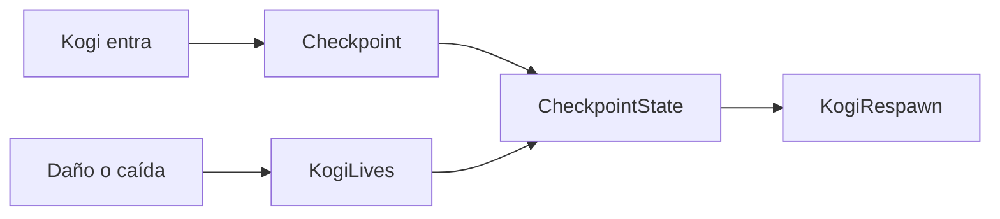

# Sesión 40: activar checkpoints 🚩

Duración aproximada: 45–60 minutos.

## 🎯 Objetivo

Registrar un punto seguro dentro del nivel y utilizarlo para las siguientes reapariciones de Kogi.

## ⭐ Lo nuevo

- Un checkpoint es un Trigger que actualiza estado, no una pared.
- El punto de reaparición puede cambiar durante la partida.
- El estado se separa del objeto visual que lo activa.

## 1. Comprender el flujo

El collider detecta la entrada. `CheckpointState` recuerda el identificador y la posición; `KogiLives` los consulta cuando necesita reaparecer.

> 💡 **Qué acabas de aprender:** detectar un evento y conservar su resultado son responsabilidades distintas.

## 2. Crear el estado

1. Crea `CheckpointState.cs` dentro de `Scripts > Environment`.
2. Guarda una posición y un identificador por escena.
3. Proporciona `Activate`, `GetRespawnPosition` y `Clear`.

## 3. Crear un checkpoint

1. Crea un GameObject llamado `CheckpointDesierto`.
2. Colócalo en `(7.5, 0, 0)`, sobre la zona central del recorrido.
3. Añade `BoxCollider2D` y marca `Is Trigger`.
4. Añade el componente `Checkpoint`.
5. Usa el identificador `desierto-centro`.
6. Crea un hijo `RespawnPosition` en `(0, 0.25, 0)` y asígnalo al componente.

El hijo indica con precisión dónde reaparecerá Kogi; el collider puede ser más grande que ese punto.

## 4. Usarlo desde las vidas

1. Abre `KogiLives.cs`.
2. Antes de reaparecer, consulta `CheckpointState` con el nombre de la escena.
3. Usa el `RespawnPoint` inicial como alternativa si todavía no se activó ningún checkpoint.

## 5. Probar

1. Pierde una vida antes del checkpoint: Kogi debe volver al inicio.
2. Activa `CheckpointDesierto`.
3. Avanza y vuelve a recibir daño o caer.
4. Kogi debe reaparecer junto al checkpoint.

## ✅ Comprobación final

- [ ] El checkpoint utiliza un Trigger.
- [ ] Tiene un identificador único.
- [ ] Activarlo no bloquea el movimiento.
- [ ] Antes de activarlo se usa el punto inicial.
- [ ] Después de activarlo se usa la nueva posición.
- [ ] Console no muestra errores rojos.

## 🧰 Problemas frecuentes

- **Kogi choca con la bandera:** marca `Is Trigger`.
- **Reaparece dentro del suelo:** eleva `RespawnPosition`.
- **Siempre vuelve al inicio:** comprueba que el Trigger detecte a `KogiLives`.
- **Dos checkpoints se confunden:** utiliza identificadores distintos.

---

[⬅️ Sesión anterior](39-transicion-entre-niveles.md) · [🏠 Inicio](../../README.md) · [Siguiente sesión ➡️](41-guardar-y-cargar.md)
