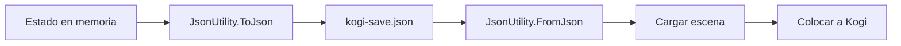

# Sesión 41: guardar y cargar la partida 💾

Duración aproximada: 60 minutos.

## 🎯 Objetivo

Guardar en un archivo la escena y el último checkpoint, y recuperarlos incluso después de cerrar el juego.

## ⭐ Lo nuevo

- **Serializar** convierte estado en texto almacenable.
- JSON permite inspeccionar una partida guardada de forma legible.
- `Application.persistentDataPath` elige una carpeta válida para cada plataforma.
- Cargar requiere restaurar datos y después colocar a Kogi.

## 1. Del estado temporal al persistente

No guardamos GameObjects completos. Guardamos datos mínimos con los que Unity puede reconstruir el estado.

> 💡 **Qué acabas de aprender:** persistir no significa copiar la escena; significa registrar decisiones importantes.

## 2. Crear `SaveGameService`

1. Crea `Assets > Kogi > Scripts > Save`.
2. Dentro, crea `SaveGameService.cs`.
3. Define `SaveData` con escena, checkpoint y coordenadas.
4. Guarda mediante `File.WriteAllText` y `JsonUtility.ToJson`.
5. Carga mediante `File.ReadAllText` y `JsonUtility.FromJson`.
6. Conserva el servicio con `DontDestroyOnLoad`.
7. Antes de cargar la escena, llama a `GameFlowController.Instance.ResumeForSceneLoad()` si existe. Esto también permite cargar después de perder: no debe quedar el panel de derrota ni una bandera de pausa antigua.
8. No guardes durante derrota o victoria: `Save()` debe ignorar la petición si `GameFlowController.IsFinished` es verdadero. El archivo anterior se conserva.

## 3. Elegir la ubicación correcta

Usa `Application.persistentDataPath`, nunca una ruta escrita como `C:\...`. Unity seleccionará una ubicación compatible con Windows, consola o móvil.

## 4. Probar

1. Ejecuta el nivel y activa un checkpoint.
2. Pulsa `F5` para guardar.
3. Muévete a otra zona.
4. Pulsa `F9` para cargar.
5. Comprueba que se abre la escena guardada y Kogi aparece en el punto registrado.
6. Detén y vuelve a ejecutar: `F9` debe seguir funcionando.
7. Prueba `F9` estando en pausa y después de perder las tres vidas. Debe restaurar una partida jugable, sin paneles antiguos.

En esta versión se guardan escena, checkpoint/posición y reliquias; las vidas vuelven al valor inicial al cargar. No se guarda todavía el estado de cada enemigo, puerta ni victoria. Las pruebas automáticas usan un archivo independiente mediante `VerificationSavePath`; la partida normal continúa usando `persistentDataPath`.

## ✅ Comprobación final

- [ ] `F5` crea `kogi-save.json`.
- [ ] El archivo contiene escena, checkpoint y posición.
- [ ] `F9` restaura la escena correcta.
- [ ] Kogi aparece en la posición guardada.
- [ ] Cargar sin archivo no produce una excepción.
- [ ] Console no muestra errores rojos.

## 🧰 Problemas frecuentes

- **El archivo desaparece del proyecto:** es correcto; vive en `persistentDataPath`, no dentro de Assets.
- **La escena no carga:** debe estar incluida en la lista del build.
- **Kogi aparece antes de existir:** espera al evento `SceneManager.sceneLoaded`.
- **El JSON está vacío:** marca `SaveData` con `[Serializable]` y usa campos serializables.

---

[⬅️ Sesión anterior](40-checkpoints.md) · [🏠 Inicio](../../README.md) · [Siguiente sesión ➡️](42-coleccionables.md)
