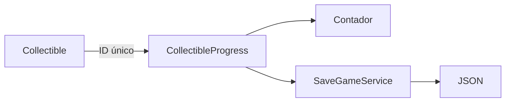

# Sesión 42: recoger reliquias persistentes 💎

Duración aproximada: 45–60 minutos.

## 🎯 Objetivo

Recoger reliquias, mostrar su cantidad y conservarlas al guardar y cargar.

## ⭐ Lo nuevo

- Cada objeto persistente necesita un identificador único.
- `HashSet` evita registrar dos veces el mismo elemento.
- Destruir la representación no equivale a guardar su estado.

## 1. Comprender la identidad

Al cargar, cada reliquia consulta si su identificador ya está registrado. Si lo está, desaparece inmediatamente.

> 💡 **Qué acabas de aprender:** la identidad estable permite reconstruir cambios realizados en una escena.

## 2. Crear el progreso

1. Crea `CollectibleProgress.cs` en `Scripts > Environment`.
2. Guarda identificadores en un `HashSet<string>`.
3. Expón `Collect`, `Contains`, `GetIds` y `Restore`.
4. Emite `CountChanged` cuando cambie la cantidad.

## 3. Crear una reliquia

1. Crea un sprite provisional llamado `ReliquiaDesierto01`.
2. Colócalo en `(4, 0.5, 0)`.
3. Añade un `CircleCollider2D` y marca `Is Trigger`.
4. Añade `Collectible`.
5. Usa el ID `desert-relic-01`.
6. Crea una segunda reliquia en `(8, 0.5, 0)` con ID `desert-relic-02`.

## 4. Guardar las reliquias

1. Añade el arreglo `collectibles` a `SaveData`.
2. Al guardar, utiliza `CollectibleProgress.GetIds()`.
3. Al cargar, llama a `CollectibleProgress.Restore` antes de abrir la escena.

## 5. Probar

1. Recoge una reliquia.
2. Comprueba que el contador aumenta.
3. Guarda con `F5`.
4. Recoge la segunda.
5. Carga con `F9`.
6. La primera debe seguir ausente y la segunda debe reaparecer.

## ✅ Comprobación final

- [ ] Hay dos reliquias con IDs diferentes.
- [ ] Cada una aumenta el contador una sola vez.
- [ ] Guardar registra los IDs recogidos.
- [ ] Cargar reconstruye correctamente cuáles permanecen.
- [ ] El contador coincide con el progreso cargado.
- [ ] Console no muestra errores rojos.

## 🧰 Problemas frecuentes

- **Una reliquia cuenta varias veces:** utiliza `HashSet` y destrúyela después de registrarla.
- **Dos desaparecen juntas:** sus IDs están repetidos.
- **Vuelve después de cargar:** incluye el arreglo en `SaveData` y restáuralo antes de cargar la escena.
- **Kogi choca con ella:** activa `Is Trigger`.

---

[⬅️ Sesión anterior](41-guardar-y-cargar.md) · [🏠 Inicio](../../README.md) · [Siguiente sesión ➡️](43-interacciones.md)
