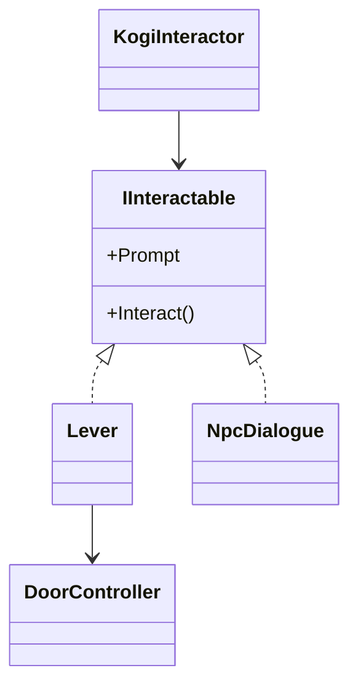

# Sesión 43: interactuar con el mundo 🗨️

Duración aproximada: 60 minutos.

## 🎯 Objetivo

Usar una misma acción para accionar una palanca, abrir una puerta y conversar con un personaje.

## ⭐ Lo nuevo

- Una **interfaz C#** expresa una capacidad compartida.
- Kogi busca objetos cercanos sin conocer sus clases concretas.
- Una palanca puede coordinar otro objeto mediante una referencia.

## 1. Crear el contrato

`IInteractable` no es un componente ni un GameObject: es un contrato que varias clases pueden cumplir.

> 💡 **Qué acabas de aprender:** programar contra capacidades reduce el acoplamiento entre objetos.

## 2. Preparar a Kogi

1. Añade `KogiInteractor` a Kogi.
2. Crea un hijo `InteractionOrigin` en `(0.7, 0, 0)`.
3. Asígnalo como origen y usa radio `1.2`.
4. La acción existente `Interact` del mapa Player llamará a `OnInteract` mediante Send Messages.
5. En **InputSystem_Actions > Player > Interact**, conserva el tipo **Button**, la interacción **Hold** y el enlace **E [Keyboard]**. En mando es **Button North**. Mantén la tecla aproximadamente un segundo; una pulsación muy breve no completa Hold.
6. Recibe `InputValue value` en `OnInteract` y sal inmediatamente si `!value.isPressed`. La notificación al soltar no debe volver a alternar la puerta. Ignora también la interacción si el tiempo está pausado o la partida ha terminado.

## 3. Crear puerta y palanca

1. Crea `PuertaSantuario` con sprite y `BoxCollider2D`.
2. Añade `DoorController`; su desplazamiento abierto será `(0, 3, 0)`.
3. Crea `PalancaSantuario` con un collider pequeño.
4. Añade `Lever` y arrastra `PuertaSantuario` a `Controlled Door`.

## 4. Crear un personaje de prueba

1. Crea `ViajeroPrueba`.
2. Añade `CircleCollider2D` marcado como Trigger.
3. Añade `NpcDialogue`.
4. Escribe un mensaje breve relacionado con las ruinas.

## 5. Probar

1. Acércate al pequeño rectángulo amarillo de la palanca, a la izquierda del muro azul. Mantén **E** aproximadamente un segundo y suéltala.
2. Comprueba que la puerta sube suavemente.
3. La puerta debe permanecer abierta al soltar E. Mantén E una segunda vez y confirma que se cierra.
4. Acércate al viajero e interactúa.
5. Comprueba que aparece y desaparece el diálogo.

## ✅ Comprobación final

- [ ] Kogi tiene un único `KogiInteractor`.
- [ ] La palanca implementa `IInteractable`.
- [ ] La puerta se abre y cierra.
- [ ] El NPC muestra un diálogo.
- [ ] La misma entrada sirve para ambos objetos.
- [ ] Console no muestra errores rojos.

## 🧰 Problemas frecuentes

- **No sucede nada:** confirma que `PlayerInput` usa Send Messages y que existe la acción `Interact`.
- **Se abre y se cierra al soltar:** falta ignorar `!value.isPressed` en `OnInteract(InputValue value)`.
- **La palanca no encuentra la puerta:** asigna `Controlled Door`.
- **Kogi debe estar demasiado cerca:** ajusta `interactionRadius` o `InteractionOrigin`.
- **Interactúa con el objeto equivocado:** separa sus colliders de interacción.

---

[⬅️ Sesión anterior](42-coleccionables.md) · [🏠 Inicio](../../README.md) · [Siguiente sesión ➡️](44-variantes-de-enemigos.md)
