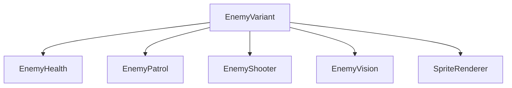

# Sesión 44: crear variantes de enemigos 🛡️

Duración aproximada: 45–60 minutos.

## 🎯 Objetivo

Crear enemigos distintos reutilizando el mismo comportamiento y modificando salud, velocidad, alcance, disparo y color.

## ⭐ Lo nuevo

- Una variante es una configuración, no necesariamente otra clase completa.
- Un `enum` limita las opciones a valores válidos y legibles.
- Los componentes exponen métodos `Configure` para recibir parámetros sin revelar sus campos internos.

## 1. Reutilizar composición

Todos conservan `EnemyBrain`; cambia su personalidad mediante números coordinados.

> 💡 **Qué acabas de aprender:** composición más configuración evita duplicar inteligencia artificial.

## 2. Exponer configuración segura

1. Añade `Configure` a `EnemyHealth`, `EnemyPatrol`, `EnemyShooter` y `EnemyVision`.
2. Limita los valores mediante `Mathf.Max`.
3. No conviertas todos los campos privados en públicos.

## 3. Crear las variantes

1. Crea `EnemyVariant.cs` dentro de `Scripts > Enemies`.
2. Define `Scout`, `Guardian` y `Elite`.
3. Configura:

| Variante | Vida | Velocidad | Disparo | Alcance |
|---|---:|---:|---:|---:|
| Scout | 2 | 3.4 | 2.4 s | 7 |
| Guardian | 3 | 2 | 2 s | 6 |
| Elite | 6 | 1.4 | 1.25 s | 8 |

## 4. Aplicarlas

1. Añade `EnemyVariant` a `GuardiaIzquierda` y elige `Scout`.
2. Añádelo a `GuardiaBasico` y elige `Guardian`.
3. Duplica un guardia en `SantuarioPrueba`, nómbralo `GuardiaElite` y elige `Elite`.

Los colores siguen siendo provisionales; comunican rápidamente la variante durante las pruebas.

## 5. Probar

1. Observa que Scout patrulla más rápido.
2. Comprueba que Guardian conserva el comportamiento conocido.
3. Ataca a Elite y verifica que resiste más impactos.
4. Permite que Elite detecte a Kogi y compara la frecuencia de disparo.

## ✅ Comprobación final

- [ ] Las tres variantes usan los mismos componentes base.
- [ ] Scout es rápido y frágil.
- [ ] Guardian es equilibrado.
- [ ] Elite es resistente y dispara con mayor frecuencia.
- [ ] Los valores se aplican sin duplicar `EnemyBrain`.
- [ ] Console no muestra errores rojos.

## 🧰 Problemas frecuentes

- **Todas se comportan igual:** comprueba que cada instancia tenga `EnemyVariant` y una opción distinta.
- **La vida no cambia:** `EnemyHealth.Configure` debe actualizar máximo y valor actual.
- **El color vuelve al anterior:** identifica qué otro componente modifica `SpriteRenderer.color`.

---

[⬅️ Sesión anterior](43-interacciones.md) · [🏠 Inicio](../../README.md) · [Siguiente sesión ➡️](45-jefe-del-desierto.md)
