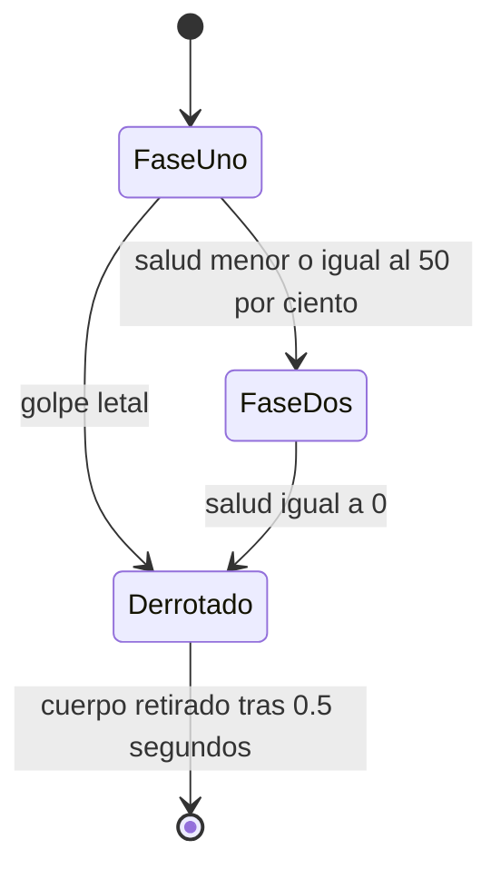

# Sesión 45: crear un jefe con dos fases 👑

Duración aproximada: 60–75 minutos.

## 🎯 Objetivo

Construir un Guardián del Desierto con más salud, barra visible y una segunda fase más agresiva.

## ⭐ Lo nuevo

- Una pelea de jefe comunica progreso mediante una barra de salud.
- Una **fase** cambia reglas cuando se cumple una condición.
- El umbral se calcula como proporción, no con un número rígido de golpes.

## 1. Comprender las fases



El jefe reutiliza `EnemyHealth`, `EnemyVision`, `EnemyShooter` y el proyectil existente. `DesertWarden` coordina exclusivamente las reglas especiales de la pelea.

> 💡 **Qué acabas de aprender:** un jefe puede construirse combinando sistemas conocidos con una capa nueva de coordinación.

## 2. Crear el controlador

1. Crea `DesertWarden.cs` en `Scripts > Enemies`.
2. Configura `maximumHealth = 12`.
3. Usa `secondPhaseThreshold = 0.5`.
4. En la primera fase dispara cada `1.6` segundos.
5. En la segunda fase dispara cada `0.75` segundos.
6. Cambia ligeramente color y escala para comunicar la transición.

## 3. Crear el jefe

1. Duplica `GuardiaElite` dentro de `SantuarioPrueba`.
2. Renómbralo `GuardianDelDesierto`.
3. Colócalo en `(10.5, 0, 0)` y aumenta su escala a `(1.8, 1.8, 1)`. Son los valores usados por el montaje automatizado de esta sesión.
4. Desactiva `EnemyBrain` y `EnemyPatrol`. En `EnemyVariant`, abre el menú de los tres puntos del componente y elige **Remove Component**, solo en este jefe; no lo elimines de los otros guardias ni apliques la eliminación a su prefab compartido.
5. Añade `DesertWarden`.
6. Conserva salud, visión, disparo, collider y Rigidbody2D.

¿Por qué retiramos `EnemyVariant` en vez de desmarcarlo? Su método `Awake` configura la salud y puede ejecutarse aunque el componente esté deshabilitado. Si lo conservamos, puede sobrescribir las 12 vidas del jefe con las de un guardia. Aquí `DesertWarden` debe ser el único responsable de configurar esas reglas.

## 4. Mostrar la salud

`DesertWarden.OnGUI` dibuja una barra superior mientras el jefe está vivo. El color cambia al entrar en la segunda fase.

La interfaz provisional sirve para validar reglas; posteriormente la sustituiremos por UI artística.

## 5. Hacer que morir también libere el paso

Ocultar una barra no elimina al personaje. El `SpriteRenderer` sigue dibujándolo y su `Collider2D` sigue siendo un obstáculo mientras no indiquemos lo contrario.

En los guardias normales, `EnemyBrain` se ocupa de la muerte. Como lo hemos desactivado en el jefe, ahora esa responsabilidad corresponde a `DesertWarden`.

1. Añade este campo dentro de `DesertWarden`, junto a las otras variables configurables:

```csharp
[SerializeField, Min(0f)]
private float deathDelay = 0.5f;
```

2. En el componente **Desert Warden**, deja **Death Delay = 0.5**. Es el tiempo que conservamos la imagen de derrota, no el tiempo que sigue siendo peligroso.
3. Conserva la suscripción `health.Died += HandleDefeated` en `OnEnable` y su retirada en `OnDisable`. `EnemyHealth` emite ese evento cuando la salud llega a cero.
4. Implementa el método de muerte así:

```csharp
private void HandleDefeated()
{
    if (defeated)
    {
        return;
    }

    defeated = true;
    shooter.enabled = false;
    vision.enabled = false;

    foreach (EnemyContactDamage contactDamage in GetComponentsInChildren<EnemyContactDamage>(true))
    {
        contactDamage.enabled = false;
    }

    foreach (Collider2D bodyCollider in GetComponentsInChildren<Collider2D>(true))
    {
        bodyCollider.enabled = false;
    }

    foreach (Rigidbody2D body in GetComponentsInChildren<Rigidbody2D>(true))
    {
        body.linearVelocity = Vector2.zero;
        body.angularVelocity = 0f;
        body.simulated = false;
    }

    visual.color = Color.gray;
    StartCoroutine(FinishDefeat());
    Debug.Log("Guardián del Desierto derrotado");
}

private IEnumerator FinishDefeat()
{
    yield return new WaitForSeconds(deathDelay);
    if (GameFlowController.Instance != null)
    {
        GameFlowController.Instance.ShowVictory();
    }
    Destroy(gameObject);
}
```

Añade `using System.Collections;` y `using Kogi.Scripts.UI;` al principio del archivo. La corrutina espera medio segundo, comunica la victoria y retira al jefe. No congeles el tiempo antes de esa espera: `WaitForSeconds` utiliza el tiempo del juego.

Leámoslo en el orden en que ocurre:

- `defeated` evita procesar la muerte dos veces y hace que `Update` y `OnGUI` dejen de atacar y dibujar la barra.
- Desactivamos visión, disparo y daño por contacto. En `EnemyContactDamage` conservamos la comprobación `isActiveAndEnabled` explicada en la sesión 13.
- Desactivamos los colliders: Kogi puede pasar inmediatamente por ese espacio.
- Detenemos las velocidades y ponemos `simulated = false`: la física deja de mover el cuerpo.
- El color gris comunica la derrota; `FinishDefeat` espera medio segundo de tiempo de juego, muestra la victoria y retira el GameObject y sus hijos. Si pausas durante esa espera, también se pausa.

`GetComponentsInChildren<T>(true)` busca tanto en el propio jefe como en sus hijos, incluidos los inactivos. Así no queda un collider secundario bloqueando el camino.

Los proyectiles que ya estaban en vuelo conservan su comportamiento; lo que se detiene inmediatamente es el cuerpo del jefe y la creación de nuevos ataques.

> 💡 **Qué acabas de aprender:** salud, colisiones e imagen son responsabilidades diferentes. Llegar a cero vidas debe coordinar las tres, no solo ocultar la interfaz.

## 6. Cerrar el prototipo con una victoria

1. En `GameFlowController`, añade `IsVictory` y `IsFinished => IsGameOver || IsVictory`.
2. Crea `ShowVictory()`. Si ya existe un estado final, no hagas nada; en otro caso marca victoria y utiliza la misma congelación de entrada, tiempo y audio que en la derrota.
3. En `OnGUI`, muestra **¡SANTUARIO COMPLETADO!**, una explicación de que termina el prototipo y el botón **Jugar de nuevo (R)**. En el ejecutable añade **Salir** con `Application.Quit()`; no cierres el Editor con ese botón.
4. Implementa `RestartPrototype()`: limpia el estado final y la pausa, vacía los checkpoints y las reliquias de la partida en memoria y carga `NivelDesierto`. La nueva escena devuelve las tres vidas iniciales.
5. No borres el archivo guardado. Volver a jugar inicia una sesión nueva, pero el jugador puede recuperar su guardado con F9.

Esta victoria cierra la demostración de aprendizaje, no la historia completa de Kogi. No añadimos todavía otro nivel ni un menú principal inexistente.

## 7. Probar

1. Entra en `SantuarioPrueba`.
2. Acércate al jefe y observa la barra.
3. Mirando hacia él, ataca de cerca con **Enter** o lanza una daga con **Q** hasta reducir su salud a la mitad.
4. Comprueba cambio de color, tamaño y frecuencia de disparo.
5. Derrótalo y confirma que la barra desaparece, el cuerpo se vuelve gris y desaparece tras medio segundo.
6. Durante el breve estado de derrota sus colliders ya deben estar desactivados. Después aparece **¡SANTUARIO COMPLETADO!** y el mundo queda congelado: ahora ese cierre es intencional, no un bloqueo del cuerpo.
7. Comprueba en **Hierarchy**, durante Play, que `GuardianDelDesierto` ya no existe. Al salir de Play reaparece porque esa derrota pertenece a la partida, no modifica la escena guardada.
8. Pulsa Escape: no debe ocultar la victoria ni reactivar enemigos. Pulsa **Jugar de nuevo** o R: debes volver al desierto con tres vidas.

## ✅ Comprobación final

- [ ] El jefe comienza con 12 puntos de salud.
- [ ] La barra refleja el daño recibido.
- [ ] La segunda fase comienza al 50 %.
- [ ] La frecuencia de ataque aumenta.
- [ ] Al morir deja de generar ataques y desaparece la barra.
- [ ] Sus colliders y su daño por contacto se desactivan inmediatamente.
- [ ] El cuerpo queda gris y se retira tras 0.5 segundos; aparece la victoria del prototipo.
- [ ] R inicia una nueva partida en el desierto y conserva el archivo de guardado.
- [ ] Console no muestra errores rojos.

## 🧰 Problemas frecuentes

- **Dispara dos veces desde dos sistemas:** desactiva `EnemyBrain` en el jefe.
- **No aparece la barra:** confirma que `DesertWarden` esté habilitado.
- **No entra en fase dos:** `EnemyHealth.Configure` debe establecer salud máxima y actual.
- **Comienza con 3 o 6 vidas en vez de 12:** elimina `EnemyVariant` del jefe como indica el paso 3; deshabilitarlo no impide que su `Awake` reconfigure la salud.
- **No puede disparar:** conserva las referencias de `EnemyShooter` al punto de fuego y prefab.
- **La barra desaparece pero queda un bloque morado:** era un error de la versión inicial de esta sesión. `HandleDefeated` solo marcaba `defeated = true`; faltaba desactivar colisiones y retirar el cuerpo. Aplica el método completo del paso 5 y reinicia Play para probar con una instancia nueva.

---

[⬅️ Sesión anterior](44-variantes-de-enemigos.md) · [🏠 Inicio](../../README.md) · [Siguiente sesión ➡️](46-pruebas-y-build.md)
