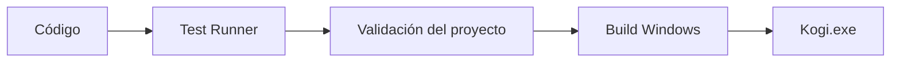

# Sesión 46: probar, optimizar y crear una build ✅

Duración aproximada: 60–90 minutos.

## 🎯 Objetivo

Cerrar el bloque de fundamentos con pruebas automáticas, validación del proyecto y una versión ejecutable para Windows.

## ⭐ Lo nuevo

- Una prueba automatizada comprueba reglas sin jugar manualmente todo el nivel.
- Una validación editorial detecta configuración incompleta antes de construir.
- Una **build** transforma el proyecto en un programa distribuible.
- El Profiler permite optimizar con mediciones en vez de suposiciones.

## 1. Crear pruebas pequeñas



Las primeras pruebas cubren reglas puras: fallback del checkpoint, activación y unicidad de coleccionables.

> 💡 **Qué acabas de aprender:** una prueba útil protege una regla concreta y ofrece un resultado repetible.

## 2. Ejecutar Test Runner

1. Abre **Window > General > Test Runner**.
2. Selecciona **EditMode**.
3. Pulsa **Run All**.
4. Comprueba que las pruebas de `FoundationProgressTests`, `SceneSetupComponentTests` y `DesertWardenDeathTests` aparecen verdes.

`SceneSetupComponentTests` protege la corrección de la sesión 39: añadir un componente ausente, reutilizar uno existente sin duplicarlo y recrear uno eliminado. Estas comprobaciones deben ejecutarse en Unity, donde se reproduce su tratamiento especial de referencias nulas. Compilar con .NET por sí solo no prueba este comportamiento.

No sustituyen la prueba jugable; la complementan.

`DesertWardenDeathTests` protege la corrección de la sesión 45. Aunque aparece en **EditMode**, entra temporalmente en **Play** para comprobar los eventos reales y la eliminación retardada del jefe, y vuelve a edición al finalizar. Guarda tu trabajo y sal de Play antes de ejecutarla.

La prueba comprueba que un golpe no letal conserva la colisión; el golpe letal emite una sola muerte, detiene la física, desactiva colliders del cuerpo y de hijos, desactiva daño/visión/disparo y retira el GameObject. No basta con comprobar que su barra desaparezca.

## 3. Validar el proyecto

1. Abre el menú superior **Kogi > Validate > Project**.
2. La validación comprueba las dos escenas del juego y la existencia de scripts.
3. Debe aparecer `Kogi project validation passed` en Console.

## 4. Revisar rendimiento

1. Abre **Window > Analysis > Profiler**.
2. Ejecuta el nivel durante al menos 30 segundos.
3. Recorre partículas, enemigos y jefe.
4. Comprueba que no aparecen aumentos continuos de memoria.
5. Mantén como referencia inicial 60 imágenes por segundo en el equipo de desarrollo.

No optimices únicamente porque un método “parezca caro”. Mide primero y corrige el cuello de botella demostrado.

El proyecto incluye `PrototypeVerification`, una comprobación dirigida que también toma una muestra de 30 segundos con `ProfilerRecorder`. Registra FPS medios, tiempo de frame del percentil 95 (el 95 % de los frames tarda como máximo ese valor), tiempo medio del hilo principal y memoria usada. Mide por separado en el Editor y en Windows: el Editor añade su propio consumo.

La prueba aísla enemigos durante las comprobaciones de entrada y progreso. Para medir rendimiento los reactiva, desplaza la cámara por el nivel y genera proyectiles, manteniendo al jugador fuera del contacto físico para que una derrota no interrumpa la muestra. Es una prueba reproducible, no una medición de todos los combates posibles ni una garantía de ausencia de fugas. Un incremento breve de memoria puede corresponder a cachés o a memoria pendiente de recolección; para diagnosticar una fuga hay que repetir recorridos y comparar capturas.

## 5. Crear la build

1. Guarda todas las escenas.
2. Ejecuta **Kogi > Build > Windows 64-bit**.
3. Espera a que Unity termine.
4. Abre `Builds > Windows` en la **raíz del repositorio**, al lado de la carpeta `Kogi` (no dentro de `Kogi/Assets`).
5. Ejecuta `Kogi.exe`.

La carpeta `Builds` está ignorada por Git porque es un resultado reproducible, no código fuente.

Conserva la carpeta completa: `Kogi.exe` necesita `Kogi_Data`, `UnityPlayer.dll` y los demás archivos generados. No distribuyas solo el `.exe`.

## 6. Repetir las comprobaciones en Windows

1. Sal de Play y guarda las escenas.
2. Ejecuta **Kogi > Build > Windows verification player**. Se crea una versión de desarrollo en `Builds/VerificationPlayer`, separada de la versión normal.
3. Abre PowerShell en la raíz del repositorio y ejecuta:

```powershell
& ".\Builds\VerificationPlayer\Kogi.exe" -kogi-verify "$PWD\Builds\VerificationWindows" -screen-fullscreen 0 -screen-width 1280 -screen-height 720 -logFile "$PWD\Builds\VerificationWindows-player.log"
```

4. No pulses teclas durante el recorrido. El programa crea teclado y ratón virtuales, comprueba sistemas y termina automáticamente. No se necesita el Editor para ejecutarlo.
5. Abre `Builds/VerificationWindows/verification.json`: `passed` debe ser `true` y `errors` debe estar vacío. La lista `checks` indica exactamente qué se comprobó; `victory.png` permite revisar la pantalla final.
6. La prueba guarda en su propio `test-save.json`; no sobrescribe `kogi-save.json` del jugador. Este modo solo se compila en el Editor y en builds de desarrollo y solo arranca si se solicita expresamente.
7. Finalmente abre la versión normal de `Builds/Windows/Kogi.exe` sin esos argumentos y prueba el inicio. Comprueba que no aparecen excepciones en su registro.

El recorrido automatizado usa entradas reales para movimiento, salto, agachado, espada, daga y palanca, y reposicionamientos controlados para ejercitar triggers de reliquias, checkpoint y portal. Aplica daño directamente para probar estados, de modo que **no sustituye una revisión humana de dificultad, distancias de salto ni calidad de animación**.

## 7. Cerrar la partida de prueba

1. Derrota al Guardián del Desierto.
2. Comprueba que su cuerpo deja de colisionar, se retira y aparece **¡SANTUARIO COMPLETADO!**.
3. Pulsa Escape: no debe reactivar la simulación detrás del panel.
4. Usa **Jugar de nuevo (R)**: vuelves al desierto con tres vidas y el progreso de sesión reiniciado. Tu archivo guardado permanece disponible.
5. En Windows, **Salir** cierra el ejecutable. En el Editor termina Play con su botón habitual.

## ✅ Comprobación final

- [ ] La solución compila sin errores ni advertencias propias.
- [ ] Pasan las pruebas EditMode de progreso y de creación de componentes.
- [ ] Pasa la regresión de muerte del jefe, que entra temporalmente en Play.
- [ ] La validación reconoce ambas escenas.
- [ ] NivelDesierto y SantuarioPrueba son navegables.
- [ ] Pausa, guardado, reliquias, interacción, variantes y jefe funcionan.
- [ ] El jefe deja de bloquear inmediatamente y su retirada muestra la victoria del prototipo.
- [ ] «Jugar de nuevo» vuelve al desierto sin borrar el archivo guardado.
- [ ] Se genera `Builds/Windows/Kogi.exe`.
- [ ] El ejecutable inicia sin depender del Editor.
- [ ] Console no muestra errores rojos.

## 🧰 Problemas frecuentes

- **Las pruebas no aparecen:** abre la pestaña EditMode y deja el archivo dentro de una carpeta Editor.
- **Falla la validación:** revisa la lista de escenas del build.
- **No existe soporte Windows:** instala el módulo correspondiente desde Unity Hub.
- **La build falla por scripts:** corrige primero todos los errores de Console.
- **El ejecutable abre otra escena:** coloca `NivelDesierto` primero entre las escenas habilitadas.
- **Aviso de RuntimePipelineConfig ausente:** indica que la conexión de automatización de Pipeline no estará activa dentro del ejecutable. El juego no necesita esa conexión; no es un error de gameplay.
- **FPS extremadamente altos o captura negra al probar oculto:** repite con la ventana visible. Una ejecución sin presentación normal no sirve para medir el coste gráfico real.

## Registro del cierre

El resultado real de las comprobaciones, la build y las mediciones está en el [informe de cierre de la sesión 46](../verificacion-cierre-sesion-46.md). Esta lista de comprobación se mantiene como guía para futuras ejecuciones; el informe distingue qué se verificó automáticamente y qué requiere revisión humana.

---

[⬅️ Sesión anterior](45-jefe-del-desierto.md) · [🏠 Inicio](../../README.md)
